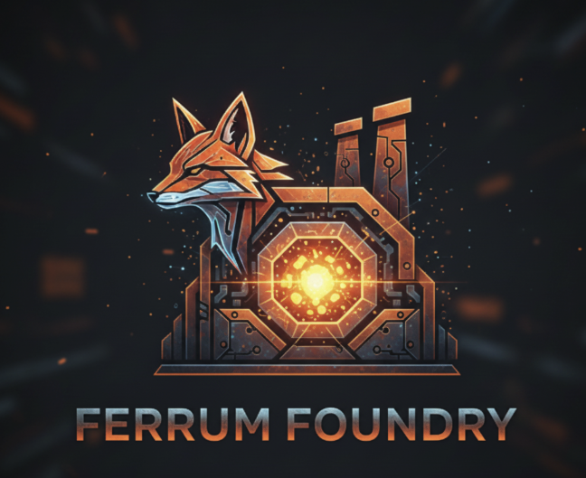

<p align="center">
  
</p>

<h1 align="center">Ferrum Foundry</h1>

<p align="center">
  <a href="https://github.com/ferrum-edge/ferrum-foundry/actions/workflows/ci.yml"></a>
  <a href="https://github.com/ferrum-edge/ferrum-foundry/actions/workflows/release.yml"></a>
  <a href="https://github.com/ferrum-edge/ferrum-foundry/blob/main/LICENSE"></a>
  
  
</p>

Admin panel UI for managing and observing the [Ferrum Edge](https://github.com/ferrum-edge/ferrum-edge) Proxy/Gateway.

## Features

- **Resource Management** - Full CRUD for Proxies (HTTP + TCP/UDP/DTLS stream routes), Consumers, Plugins, and Upstreams with paginated tables supporting 50k+ records via virtual scrolling
- **Relational Browsing** - Navigate Proxy -> Plugins -> Upstream -> Targets (with subsets and locality) via tabs and breadcrumbs
- **Consumer Credentials** - Manage key-auth, basic-auth, JWT, HMAC, and mTLS credential rotation arrays with ACL groups
- **Plugin Configuration** - Category-grouped catalog of 80+ gateway plugins (auth, security/WAF, traffic control, AI gateway, mesh, observability, billing) with default config templates, per-instance execution triggers, and scope (global/proxy/group) support
- **TLS Management** - Certificate/CA/CRL/OCSP/JWKS stores, ACME order automation (HTTP-01/TLS-ALPN-01/DNS-01), material inventory with expiry tracking, surface rotation, and PEM validation
- **API Spec Import** - Create spec-managed proxies, upstreams, and plugins from OpenAPI documents (`x-ferrum-proxy` extensions) with replace/delete lifecycle
- **Metrics Dashboard** - Gateway stats, overload protection, host runtime, circuit breakers, connection pools, health checks, load balancers, caches, API chargeback, and Prometheus metrics with configurable auto-refresh
- **Operations** - Audit log with filters and redacted diffs, CP/DP cluster topology, backend protocol capability probes, and full configuration backup/restore
- **Mesh Observability** - Service graph, config/slice drift, policy denies, remote clusters and federation, egress scope testing, waypoints, and SPIFFE gateway trust (mesh-mode gateways)
- **Health Monitoring** - Real-time gateway, database, and FIPS/readiness status
- **Namespace Support** - Browse and manage resources across namespaces via `X-Ferrum-Namespace`
- **Dark / Light Theme** - Dark theme by default with a light theme toggle in the header

## Architecture

```
Browser <-> Fastify BFF (Node.js) <-> Ferrum Admin API
                |
          JWT generation
          TLS trust store
          Timeout enforcement
          SPA serving (prod)
```

The BFF (Backend-for-Frontend) handles TLS trust stores, connection/read/write timeouts, and JWT generation server-side - capabilities browsers cannot provide.

## Quick Start

### Prerequisites

- Node.js 22+
- npm 10+

### Local Development

```bash
npm install
```

Set required environment variables:

```bash
export FERRUM_ADMIN_URL=http://localhost:9000   # Ferrum Admin API URL
export FERRUM_JWT_SECRET=$(openssl rand -hex 32)       # HS256 signing key (32+ chars)
export FERRUM_BFF_AUTH_TOKEN=$(openssl rand -hex 32)  # Development login exchange token
```

Static-token authentication is intended for local development only. The SPA
exchanges `FERRUM_BFF_AUTH_TOKEN` once for a bounded HttpOnly, SameSite session;
the deployment credential is never stored in browser storage or reused as a
bearer token. Production startup fails closed unless a trusted identity proxy
mode is configured. See [Production authentication](docs/authentication.md).

Optional environment variables:

| Variable | Default | Description |
|---|---|---|
| `FERRUM_JWT_ISSUER` | `ferrum-edge` | JWT issuer claim |
| `FERRUM_JWT_TTL` | `900` | JWT token TTL (seconds) |
| `FERRUM_JWT_MAX_TTL` | `3600` | Gateway-configured maximum JWT TTL |
| `FERRUM_JWT_ROLE` | `admin` | Static development role: viewer/operator/admin |
| `FERRUM_JWT_AUDIENCE` | - | Optional exact audience claim(s), comma separated |
| `FERRUM_JWT_NAMESPACES` | - | Optional exact namespace grants, comma separated |
| `FERRUM_TLS_CA_PATH` | - | Path to .pem truststore |
| `FERRUM_TLS_CA_ROOT` | CA file directory | Approved root for CA bundles |
| `FERRUM_TLS_VERIFY` | `true` | Verify TLS certificates |
| `FERRUM_CONNECT_TIMEOUT` | `5000` | Connection timeout (ms) |
| `FERRUM_READ_TIMEOUT` | `60000` | Read timeout (ms) |
| `FERRUM_WRITE_TIMEOUT` | `60000` | Write timeout (ms) |
| `FERRUM_MAX_LARGE_UPLOADS` | `2` | Maximum concurrent restore/spec uploads |
| `FERRUM_ALLOW_RUNTIME_SETTINGS` | `false` | Permit restricted browser connection overrides |
| `PORT` | `3001` | BFF server port |

Start the dev server:

```bash
npm run dev
```

This starts Vite (port 5173) and Fastify (port 3001) concurrently. Open http://localhost:5173.

No gateway handy? Run the bundled mock admin API, which serves realistic
sample data for every admin surface (CRUD, TLS/ACME, audit, cluster, mesh,
chargeback):

```bash
node scripts/mock-admin-gateway.mjs   # listens on :9000
```

To seed a real gateway, use a dedicated namespace. Seeding performs a full
replacement of that namespace, so it refuses to run without an explicit opt-in:

```bash
export FERRUM_NAMESPACE=ferrum-foundry-demo
export FERRUM_DEMO_ALLOW_DESTRUCTIVE=true
# FERRUM_JWT_SECRET is the same 32+ character admin signing key used by Ferrum.
node scripts/seed-demo-gateway.mjs
```

The payload uses deterministic resource IDs and can be run repeatedly. It
includes the current versioned API-spec backup section, current credential-array
shapes, and the same admin JWT signer used by the BFF. If Ferrum requires an
admin audience, set the same value in `FERRUM_JWT_AUDIENCE`. Configure the demo
gateway itself with `FERRUM_NAMESPACE=ferrum-foundry-demo` so it serves the
seeded routes. Containerized gateways can reach a host-side demo backend by
setting `FERRUM_DEMO_BACKEND_HOST` to a Docker host alias; override
`FERRUM_DEMO_PROXY_URL` when the data-plane origin is not
`http://127.0.0.1:8000`.

### Production Build

```bash
npm run build
npm start
```

### Docker

```bash
docker build -f docker/Dockerfile -t ferrum-foundry .

export FERRUM_JWT_SECRET=$(openssl rand -hex 32) # also configure this on Ferrum Edge
export FERRUM_TRUSTED_PROXY_SECRET=$(openssl rand -hex 32)

docker run \
  -e FERRUM_ADMIN_URL=http://your-gateway:9000 \
  -e FERRUM_JWT_SECRET \
  -e FERRUM_AUTH_MODE=trusted-proxy \
  -e FERRUM_TRUSTED_PROXY_SECRET \
  -p 127.0.0.1:8080:8080 \
  ferrum-foundry
```

The production BFF must be reachable only through the configured identity
proxy. The Docker image uses `gcr.io/distroless/nodejs22-debian13:nonroot` for
a minimal attack surface. Build inputs are allowlisted by `.dockerignore`, base
images are digest-pinned, and published images carry provenance and SBOM
attestations. See [Release and supply-chain gates](docs/release-security.md).

## Tech Stack

| Layer | Technology |
|---|---|
| Frontend | React 19, TypeScript, Tailwind CSS v4 |
| Routing | TanStack Router v1 |
| Data | TanStack Query v5, TanStack Table v8, TanStack Virtual v3 |
| UI | Radix UI primitives (Dialog, Select, Tabs, Tooltip) |
| Backend | Node.js, Fastify 5 |
| JWT | jose (HS256) |
| Docker | Distroless Node.js 22 |

## License

[PolyForm Noncommercial 1.0.0](LICENSE) - See [LICENSE-COMMERCIAL.md](LICENSE-COMMERCIAL.md) for commercial licensing.
