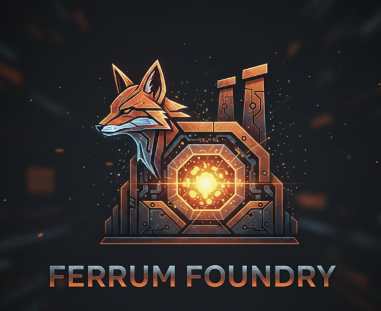
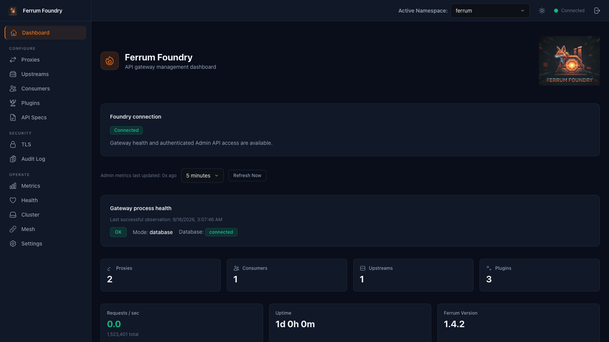
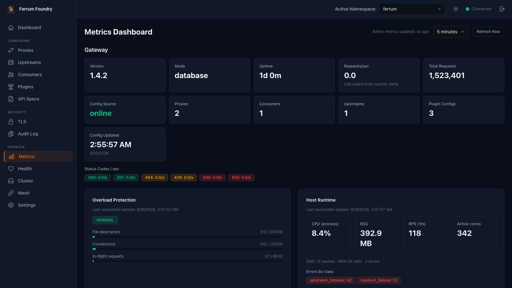
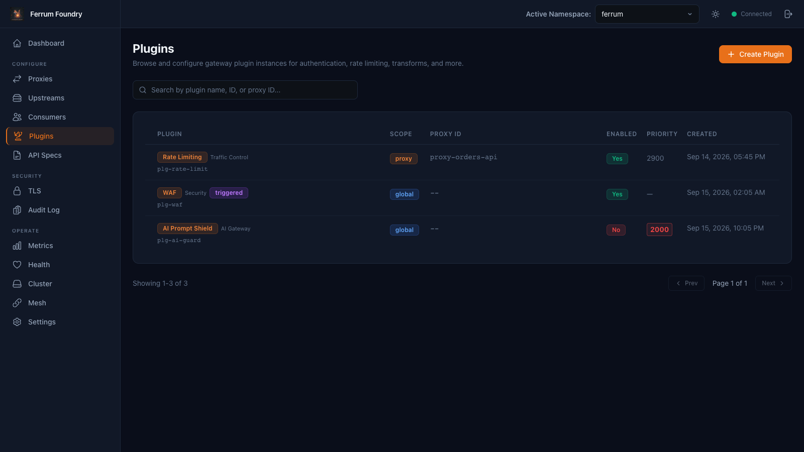
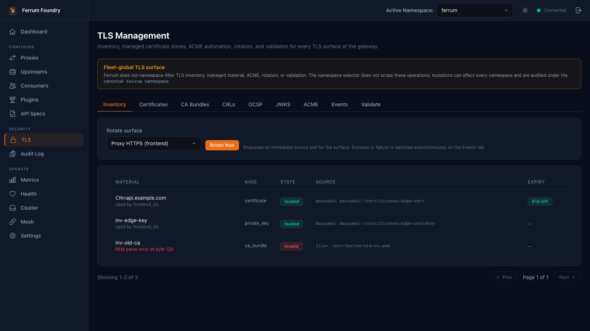
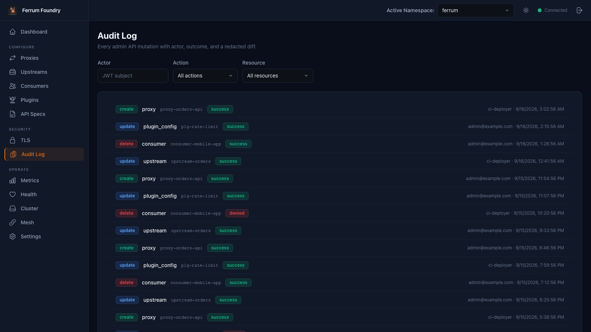

<p align="center">
  
</p>

<h1 align="center">Ferrum Foundry</h1>

<p align="center">
  <a href="https://github.com/ferrum-edge/ferrum-foundry/actions/workflows/ci.yml"></a>
  <a href="https://github.com/ferrum-edge/ferrum-foundry/actions/workflows/release.yml"></a>
  <a href="https://github.com/ferrum-edge/ferrum-foundry/blob/main/LICENSE"></a>
  
  
</p>

Admin panel UI for managing and observing the [Ferrum Edge](https://github.com/ferrum-edge/ferrum-edge) Proxy/Gateway.

## Screenshots

Captured against the bundled mock admin gateway
(`node scripts/mock-admin-gateway.mjs`) in the dark theme. Every surface below
works the same way against a live Ferrum Edge gateway.

<p align="center">
  
</p>

<table>
  <tr>
    <td width="50%" valign="top">
      
      <sub><b>Metrics</b> — gateway stats, status codes, overload protection and host runtime, one refresh policy across every panel.</sub>
    </td>
    <td width="50%" valign="top">
      
      <sub><b>Plugins</b> — category-grouped catalog of gateway plugins with scope, priority, execution triggers and enable/disable.</sub>
    </td>
  </tr>
  <tr>
    <td width="50%" valign="top">
      
      <sub><b>TLS</b> — fleet-global inventory, managed certificate stores, ACME automation, rotation and PEM validation.</sub>
    </td>
    <td width="50%" valign="top">
      
      <sub><b>Audit log</b> — recorded Admin API mutations with collection and delivery status, filterable by action and resource.</sub>
    </td>
  </tr>
</table>

## Supported Ferrum Edge version

Foundry is qualified against one Ferrum Edge image at a time. Foundry v0.4.0
pairs with the published **Ferrum Edge v0.9.10** release using the image digest
recorded in `docs/compatibility.json`. The qualification covers `database` mode
(writable and `FERRUM_ADMIN_READ_ONLY`), the trusted-proxy starter, Chromium,
and `linux/amd64` and `linux/arm64`.
Other Ferrum Edge releases, other gateway modes, and other browsers are
best-effort or not qualified.
[Supported pairing](docs/compatibility.md) has the requirements, the full
envelope, and the tested scale.

## Contracts

The org's shared vocabularies, JSON schemas, and fixtures live in
[ferrum-edge/ferrum-contracts](https://github.com/ferrum-edge/ferrum-contracts).
Foundry vendors the `plugin-catalog` and `provisioned-by` vocabularies with
their vocabulary schemas under
[`contracts/ferrum-contracts/`](contracts/ferrum-contracts/), pinned to
`contracts-edge-0.9.9` in
[`contracts/ferrum-contracts/PIN`](contracts/ferrum-contracts/PIN). The vendored
files, Foundry's local plugin names and provisioning markers, and the pin's tie
to the qualified Edge release are checked by
[Plugin configuration templates](docs/plugin-defaults.md#shared-plugin-catalog-contract).

A shared contract changes in `ferrum-contracts` first, then is re-vendored here;
never edit a vendored file locally.

## Development status

Ferrum Foundry is in active buildout and has no users yet. Expect breaking
changes; earlier development versions get no compatibility or upgrade path.
When a contract changes, update the code, tests, demo data, and docs together.

Foundry has no database, SQL schema, or migrations. Gateway data and its schema
belong to Ferrum Edge. If Foundry ever adds its own database during buildout,
keep one canonical initial schema instead of a chain of migrations. Revisit
this policy before onboarding users.

## Features

- **Resource management**: create, edit, and delete proxies (HTTP and
  TCP/UDP/DTLS stream routes), consumers, plugins, and upstreams, with
  server-paginated tables and complete-collection search.
- **Relational browsing**: move between a proxy, its plugins, its upstream,
  and targets (with subsets and locality) through tabs and breadcrumbs.
- **Consumer credentials**: key-auth, JWT, HMAC, and mTLS rotation arrays with
  ACL groups. Basic-auth passwords can be appended, replaced, or deleted; the
  gateway never returns them, so their presence shows as unknown.
- **Plugins**: a category-grouped catalog of 80+ gateway plugins (auth,
  security/WAF, traffic control, AI gateway, mesh, observability, billing) with
  default config templates, per-instance execution triggers, and
  global/proxy/group scope.
- **TLS management**: fleet-global certificate, CA, CRL, OCSP, and JWKS
  stores; ACME order automation (HTTP-01, TLS-ALPN-01, DNS-01); inventory with
  expiry tracking; surface rotation; and PEM validation. See
  [waiting-operation deadlines](docs/deployment.md#live-apply-monitoring-and-acme-issuance-deadlines)
  for live-apply monitoring and re-checking interrupted issuance.
- **API spec import**: create spec-managed proxies, upstreams, and plugins from
  OpenAPI documents (`x-ferrum-proxy` extensions), then replace or delete them
  as a unit.
- **Metrics**: gateway stats, overload protection, host runtime, circuit
  breakers, connection pools, health checks, load balancers, caches, API
  chargeback, Prometheus, and per-route metrics, under one refresh policy.
  Each panel shows when its own data was last fetched.
- **Operations**: audit log with filters and redacted diffs, CP/DP cluster
  topology, backend protocol capability probes, and full configuration backup
  and restore.
- **Mesh observability** (mesh-mode gateways): service graph, config and slice
  drift, policy denies, runtime overlays, remote clusters and federation,
  egress scope testing, waypoints, and SPIFFE gateway trust.
- **Health**: gateway readiness, listeners, audit and logging loss, database
  polling, trust freshness, and mode-specific runtime diagnostics.
- **Namespaces**: work across tenant namespaces with `X-Ferrum-Namespace`.
  Each operation stays bound to the namespace it started in (see
  [namespace binding](docs/authentication.md#namespace-binding)).
  Process-wide surfaces such as TLS stay fleet-global.
- **Dark and light themes**: dark by default, with a toggle in the header.

## Architecture

```
Browser <-> Fastify BFF (Node.js) <-> Ferrum Admin API
                |
          JWT generation
          TLS trust store
          Timeout enforcement
          SPA serving (prod)
```

The BFF (backend-for-frontend) does what a browser cannot: it holds the TLS
trust store, enforces connect/read/write timeouts, and signs admin JWTs.

The UI never presents a failed read as fact. A failed read cannot show an empty
collection, current health, or an authorization decision. Each input reports
its own failure and retry, a failed refresh names its last successful
observation, and policy or trust conclusions become **unknown**. Collections
that fail to load (such as audit and API specs) hide their rows and row
actions.

Editors keep your draft when a refresh fails: the form stays mounted and shows
a retry notice, and recovery never overwrites a draft for the same resource.
See [editor identity](docs/authentication.md#editor-identity) and
[plugin membership](docs/plugin-membership.md).

## Quick Start

Deploying rather than developing? Start with
[Getting started](docs/getting-started.md). The runnable stack in
[`deploy/starter/`](deploy/starter/README.md) takes you from nothing to an
authenticated request through the real data plane. Its `demo` profile needs no
gateway or identity provider of your own.

### Prerequisites

- Node.js 22.22.2+ (22.x), 24.15.0+ (24.x), or 26+. The container image runs
  Node.js 24 LTS.
- npm 10+

### Local Development

```bash
npm install

export FERRUM_ADMIN_URL=http://localhost:9000         # Ferrum Admin API URL
export FERRUM_JWT_SECRET=$(openssl rand -hex 32)      # HS256 signing key, 32+ bytes; must match the gateway
export FERRUM_BFF_AUTH_TOKEN=$(openssl rand -hex 32)  # development sign-in token
export FERRUM_JWT_NAMESPACES='*'                      # namespace scope: exact names, or * for every namespace

npm run dev
```

`npm run dev` starts Vite on port 5173 and the BFF on port 3001. Open
http://localhost:5173.

Static-token sign-in is for local development only. The SPA exchanges
`FERRUM_BFF_AUTH_TOKEN` once for an HttpOnly, SameSite session cookie; the
token is never stored in the browser or reused as a bearer token. Production
startup refuses static auth unless a trusted identity proxy is configured. See
[Production authentication](docs/authentication.md).

`FERRUM_JWT_NAMESPACES` scopes the development principal and is required in
static mode: a comma-separated list of exact namespace names, or `*` alone for
every namespace. Startup fails when it is unset or names no namespace (empty,
whitespace, or commas only).

Common optional variables:

| Variable | Default | Description |
|---|---|---|
| `PORT` | `3001` | BFF port. Vite also proxies `/api` to it when `VITE_BFF_URL` is unset |
| `VITE_DEV_HOST` | `localhost` | Vite listen address: `localhost`, `127.0.0.1`, `::1`, or an explicit IP. A non-loopback address (`0.0.0.0`, `::`) is an explicit opt-in |
| `VITE_DEV_PORT` | `5173` | Vite port (1-65535) |
| `VITE_BFF_URL` | `http://localhost:$PORT` | `http`/`https` origin Vite proxies `/api` to; overrides `PORT` |
| `FERRUM_JWT_TTL` | `900` | JWT lifetime in seconds |
| `FERRUM_JWT_ROLE` | `admin` | Development role: `viewer`, `operator`, or `admin` |
| `FERRUM_JWT_AUDIENCE` | - | Exact `aud` value(s), comma separated |
| `FERRUM_TLS_CA_PATH` | - | PEM truststore for an `https` admin API |
| `FERRUM_TLS_VERIFY` | `true` | Verify the admin API certificate |

Invalid values fail startup. The full list, with ranges, is in the
[configuration reference](docs/deployment.md#2-configuration-reference).

**Use one hostname.** The session cookie is host-scoped, and `localhost` and
`127.0.0.1` are different hosts. The examples use `localhost` throughout. On
dual-stack hosts Vite's `localhost` may bind only `[::1]`, so
`http://127.0.0.1:5173` is refused; set `VITE_DEV_HOST=127.0.0.1` (and the
same host in `VITE_BFF_URL`) to force IPv4.

**Running next to another Vite app.** Change the ports. One `PORT` value keeps
the BFF and Vite's `/api` proxy aligned:

```bash
VITE_DEV_PORT=5174 PORT=3002 npm run dev
```

To use a BFF that is already running elsewhere, set `VITE_BFF_URL` (for
example `http://localhost:3002`) instead of `PORT`.

### Mock gateway

No gateway handy? The bundled mock admin API serves sample data for most
surfaces (CRUD, TLS/ACME, audit, cluster, overload, chargeback, gateway trust
bundles):

```bash
node scripts/mock-admin-gateway.mjs   # listens on :9000 (MOCK_ADMIN_PORT)
```

`MOCK_GATEWAY_MODE=file` makes it a read-only gateway. Writes follow the live
Edge contract:

- proxy `auth_mode` is `single` or `multi`;
- plugin configs need `plugin_name` and `scope` (a top-level `name` is
  rejected as unknown);
- creates of proxies, consumers, upstreams, and plugin configs record
  `labels.provisioned-by` from `X-Ferrum-Provisioned-By` unless the body sets
  it; `PUT` without `labels` keeps the stored labels; empty label maps are
  omitted.

The mock is a **non-mesh** gateway. Only `GET /mesh/service-graph` returns
data; other `/mesh/*`, `/node-waypoint/*`, and `/service-waypoint/*` routes
answer `404`, and the UI shows empty states. Use a mesh-mode Ferrum Edge
gateway to see the mesh surfaces.

### Seeding a real gateway

`scripts/seed-demo-gateway.mjs` loads demo resources into a real gateway. It
**replaces the whole target namespace**, so use a dedicated namespace and
confirm the exact target:

```bash
# FERRUM_JWT_SECRET must be the gateway's admin signing key.
FERRUM_NAMESPACE=ferrum-foundry-demo \
FERRUM_DEMO_CONFIRM_TARGET='http://127.0.0.1:9000#ferrum-foundry-demo' \
node scripts/seed-demo-gateway.mjs
```

`FERRUM_DEMO_CONFIRM_TARGET` must equal `<FERRUM_ADMIN_URL>#<FERRUM_NAMESPACE>`
exactly, or the script stops before sending any request. After confirmation it
runs preflight checks, then restores the namespace with `POST /restore`:

- **Global `prometheus_metrics`**: Ferrum Edge allows one enabled global
  instance. If another namespace already has one, the seed leaves out its own
  and prints the owning namespace. Demo routes do not depend on it.
- **Basic auth**: off by default; those routes and upstreams are left out
  rather than exposed unauthenticated. Set `FERRUM_DEMO_INCLUDE_BASIC_AUTH=true`
  to include them. The gateway then needs `FERRUM_BASIC_AUTH_HMAC_SECRET`
  (32+ bytes); the seeder checks it with a probe credential and exits with
  status 1, before restoring, if it is missing.

Other inputs:

- The seed is deterministic and safe to rerun.
- `FERRUM_JWT_AUDIENCE`: set it if the gateway requires an admin audience.
- `FERRUM_DEMO_BACKEND_HOST`: host of the demo backends (default
  `127.0.0.1`); use a Docker host alias for a containerized gateway.
- `FERRUM_DEMO_PROXY_URL`: data-plane origin (default `http://127.0.0.1:8000`).
- `FERRUM_ADMIN_URL` (default `http://127.0.0.1:9000`) must be `https`, or
  `http` to a loopback address (`127.0.0.0/8`, `::1`, or `localhost`). The
  seeder and the helpers that share its configuration (verify, route smoke,
  contract smoke, capability parity) send signed admin tokens and stop before
  signing anything for a plaintext origin on another host. They have no
  override; reach a containerized gateway through a published loopback port.
- Run the gateway with `FERRUM_NAMESPACE=ferrum-foundry-demo` so it serves the
  seeded routes.

`scripts/verify-demo-gateway.mjs` and `scripts/demo-route-smoke.mjs` read the
manifest the seeder writes, so they check the same basic-auth and Prometheus
choices it made.

### Production Build

```bash
npm run build
npm start
```

### Docker

```bash
docker build -f docker/Dockerfile -t ferrum-foundry .

export FERRUM_JWT_SECRET=$(openssl rand -hex 32) # also configure this on Ferrum Edge
export FERRUM_TRUSTED_PROXY_SECRET=$(openssl rand -hex 32)

docker run \
  -e FERRUM_ADMIN_URL=https://your-gateway:9443 \
  -e FERRUM_JWT_SECRET \
  -e FERRUM_AUTH_MODE=trusted-proxy \
  -e FERRUM_TRUSTED_PROXY_SECRET \
  -p 127.0.0.1:8080:8080 \
  ferrum-foundry
```

In production the BFF must be reachable only through the identity proxy; see
[Deployment](docs/deployment.md). It also refuses to start with a plaintext
`http://` admin URL unless the host is a loopback address (`127.0.0.0/8`,
`::1`, or `localhost`), because every admin request carries a signed bearer
token. The image is temporarily based on
`node:24-trixie-slim` instead of `gcr.io/distroless/nodejs24-debian13:nonroot`,
until upstream ships a fixed OpenSSL
([#504](https://github.com/ferrum-edge/ferrum-foundry/issues/504)). Node package
managers are removed; a shell and apt/dpkg remain until #504. It runs as the
numeric non-root user `65532`. Build inputs are allowlisted by `.dockerignore`,
base images are pinned by digest (the OpenSSL packages are pinned by version
and fetched at build time until #504), and published images carry provenance
and SBOM attestations. See
[Release and supply-chain gates](docs/release-security.md).

## Documentation

- [Getting started](docs/getting-started.md): from install to a first authenticated request, using [`deploy/starter/`](deploy/starter/README.md)
- [Deployment](docs/deployment.md): production topology, configuration reference, reverse proxy and Kubernetes examples, go-live checklist
- [Production authentication](docs/authentication.md): trusted-proxy identity contract and downstream JWT claims
- [Operator visibility](docs/operator-visibility.md): health and audit evidence, proxy-bound specs, mesh runtime
- [Supported pairing](docs/compatibility.md): the qualified Ferrum Edge image, tested envelope, best-effort and unqualified modes
- [Critical journeys](e2e/README.md): the browser-to-gateway release gate and how to run it locally
- [Release and supply-chain gates](docs/release-security.md): publication gates, image tags, provenance and SBOM
- [Security](SECURITY.md): supported versions and private vulnerability reporting
- [Changelog](CHANGELOG.md)

## Tech Stack

| Layer | Technology |
|---|---|
| Frontend | React 19, TypeScript 6, Tailwind CSS v4 |
| Routing | TanStack Router v1 |
| Data | TanStack Query v5, TanStack Table v8, TanStack Virtual v3 |
| UI | Radix UI primitives (Dialog, Dropdown Menu, Select, Tabs, Tooltip) |
| Backend | Node.js, Fastify 5 |
| JWT | jose (HS256) |
| Docker | Node.js 24 slim (Debian 13), non-root; distroless return tracked in #504 |

## Resource attribution

The BFF sends `X-Ferrum-Provisioned-By: ferrum-foundry` on every proxied admin
request, and the demo seeder does the same. A gateway with resource-label
support records it as `labels.provisioned-by` on newly created proxies,
consumers, upstreams, and plugin configs, including batch creates and API-spec
imports. Existing labels survive edits, and restore keeps recorded origins.
Detail pages show all labels, including those set by other tools.

Labels are informational. They do not affect authentication, ownership, or
routing. Gateways without label support ignore the header, and resources
created before it are not labeled retroactively.

## License

[PolyForm Noncommercial 1.0.0](LICENSE) - See [LICENSE-COMMERCIAL.md](LICENSE-COMMERCIAL.md) for commercial licensing.
